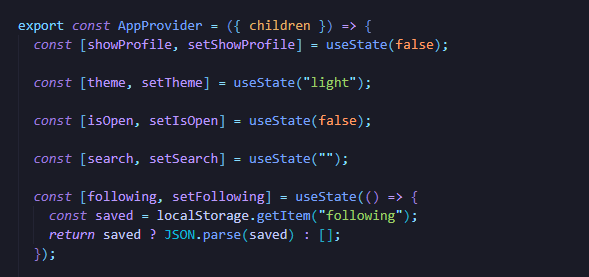
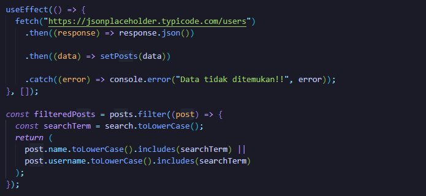
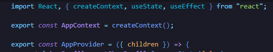
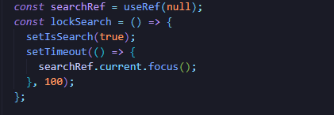

# Dokumentasi Proyek: Web Media Sosial Sederhana

## 1. Penjelasan Komponen
Proyek ini diorganisasikan ke dalam beberapa komponen modular untuk menjaga keterbacaan dan pemeliharaan kode:

*   **App.jsx**: Berperan sebagai titik pusat sekaligus pembungkus utama aplikasi yang mengintegrasikan AppProvider untuk mendistribusikan state global ke seluruh komponen anak seperti Navbar, Sidebar, dan Feed, serta mengatur struktur layout utama dengan mengaplikasikan tema yang dipilih secara menyeluruh ke dalam aplikasi.

*   **Navbar.jsx**: Berfungsi sebagai pusat navigasi aplikasi yang menyediakan fitur pencarian interaktif (menggunakan useRef untuk fokus otomatis pada input), tombol pengatur tema (dark/light mode), serta akses cepat ke profil pengguna untuk mengontrol visibilitas profil melalui state global.

*   **Sidebar.jsx**: Berfungsi sebagai panel navigasi samping yang menyediakan akses cepat ke fitur aplikasi seperti beranda, pesan, dan notifikasi, sekaligus menampilkan profil pengguna secara dinamis yang menyertakan informasi detail dan jumlah pengikut (following) yang tersinkronisasi dengan state global.

*   **PostCard.jsx**: Berfungsi sebagai komponen untuk menampilkan konten kiriman pengguna secara individual, yang mencakup informasi profil (nama dan username), logika interaksi 
seperti tombol untuk mengikuti (follow) pengguna, serta fitur untuk menyukai (like) kiriman tersebut dengan pembaruan angka yang dinamis.

*   **Feed.jsx**: Berfungsi sebagai pusat tampilan konten yang mengambil data pengguna secara otomatis dari API melalui useEffect, lalu menyaring data tersebut berdasarkan kata kunci pencarian dari AppContext agar pengguna dapat menemukan postingan secara real-time sebelum menampilkannya melalui komponen PostCard.

*   **UseContext.jsx**: Berfungsi sebagai pusat manajemen state global yang membungkus seluruh aplikasi, memungkinkan komponen-komponen di dalamnya untuk mengakses dan memodifikasi data (seperti tema, daftar pengikut, dan status pencarian) secara langsung tanpa perlu mengirimkan props secara manual ke setiap tingkatan komponen.

## 2. Implementasi Fetch API
Implementasi fetch API pada proyek ini digunakan untuk mengambil data pengguna secara asinkron dari endpoint eksternal [https://jsonplaceholder.typicode.com/users](https://jsonplaceholder.typicode.com/users). Proses ini dijalankan di dalam useEffect yang memastikan pengambilan data terjadi saat komponen pertama kali dimuat, kemudian hasilnya diproses menjadi format JSON dan disimpan ke dalam state posts.

## 3. Implementasi React Hooks
Berikut adalah penggunaan hooks untuk memenuhi kriteria fungsionalitas aplikasi:

*   **useState**: Digunakan untuk mengelola data dinamis agar aplikasi responsif terhadap interaksi pengguna. Dalam webmu, useState berfungsi menyimpan status global seperti tema aplikasi (theme), daftar pengikut (following), input pencarian (search), serta visibilitas komponen (showProfile, isOpen).

*   **useEffect**: Digunakan untuk menjalankan operasi sampingan (side effects) seperti pengambilan data.Hook ini digunakan untuk melakukan fetch data pengguna dari API saat komponen 
pertama kali dimuat.

*   **useContext**: Digunakan untuk berbagi data secara global antar komponen tanpa perlu prop-drilling. Di dalam proyek ini, hook ini diimplementasikan melalui AppProvider untuk menyediakan akses state global—seperti theme, following, search, dan fungsi terkait—ke seluruh komponen di dalam aplikasi secara langsung.

*   **useRef**: Digunakan untuk mengakses elemen DOM secara langsung tanpa memicu re-render. Hook ini diimplementasikan melalui searchRef untuk memberikan fokus secara otomatis pada elemen input pencarian setelah ikon pencarian ditekan.

---